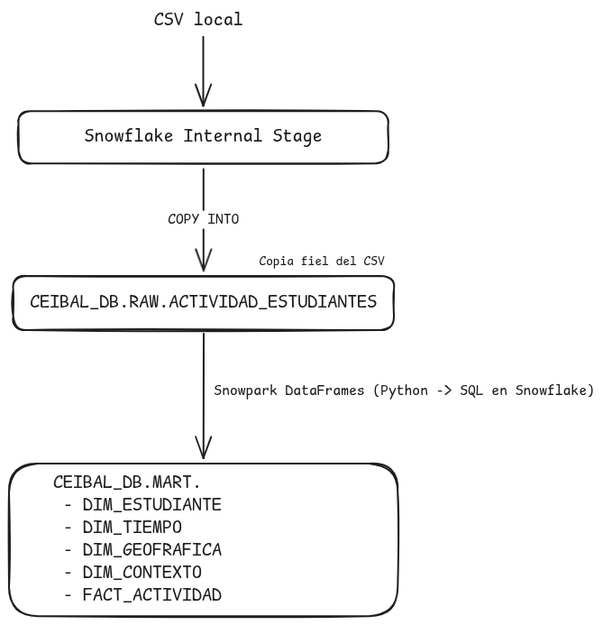
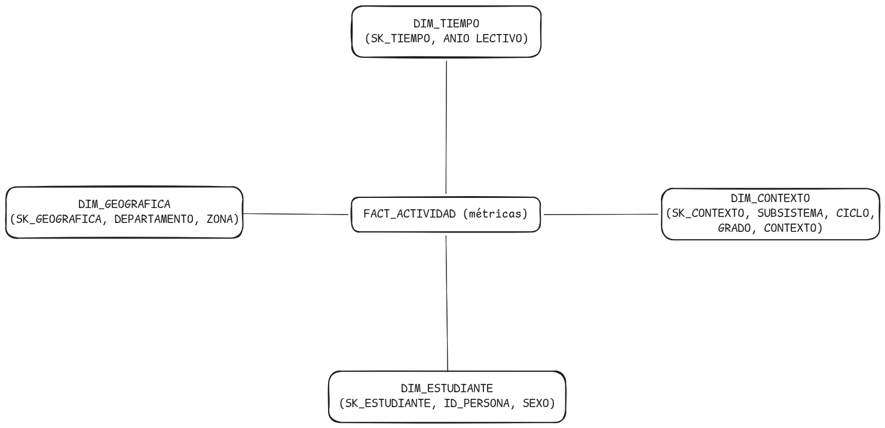

# snowflake-bi-challenge

ELT pipeline — Evaluación técnica BI Analista desarrollador, Plan Ceibal (Uruguay).

Ingesta el dataset público de actividad de estudiantes en plataformas educativas (CREA, Matific, Biblioteca País) y lo transforma en un star schema en Snowflake usando Python y Snowpark.

Datos públicos: [catalogodatos.gub.uy](https://catalogodatos.gub.uy/dataset/centro_ceibal-actividad-en-plataformas-educativas-estudiantes)

---

## Arquitectura de la solución



---

## Modelo de datos — Modelo estrella (Kimball)




**Granularidad de FACT_ACTIVIDAD:** una fila por estudiante x año lectivo x contexto educativo x geografía.

**Métricas disponibles:** días de ingreso, entregas, comentarios y acciones en CREA; días y episodios en Matific; días y préstamos en Biblioteca País.

---

## Decisiones de diseño

**¿Por qué Star Schema?**
Permite filtrar por cualquier dimensión y agregar métricas en una query simple con JOINs predecibles. Snowflake optimiza bien los JOINs entre una fact table grande y dimensiones pequeñas.

**¿Por qué una capa RAW?**
Preserva el dato original intacto (todo VARCHAR, copia fiel del CSV). Las transformaciones de tipos y limpieza ocurren en Snowpark al construir MART, sin destruir la fuente.

**¿Por qué Snowpark en lugar de SQL directo?**
La lógica de transformación queda en Python: tipada, testeable y versionada en git. La ejecución sigue siendo en Snowflake — Snowpark traduce los DataFrames a SQL internamente.

---

## Setup

```bash
pip install -r requirements.txt
cp .env.example .env
# Completar credenciales de Snowflake en .env
```

Variables requeridas en `.env`:

```
SNOWFLAKE_ACCOUNT=
SNOWFLAKE_USER=
SNOWFLAKE_PASSWORD=
SNOWFLAKE_WAREHOUSE=
SNOWFLAKE_ROLE=
```

---

## Correr el pipeline

Descargar el CSV y ubicarlo en la raíz del proyecto:
[actividad-de-estudiantes-2025.csv](https://catalogodatos.gub.uy/dataset/caf9f327-4446-4326-a6c2-450cfacf8446/resource/eb7ab748-4b66-41ab-9145-6ce0ef8ba2cb/download/actividad-de-estudiantes-2025.csv)

```bash
python main.py                 # pipeline completo (ingesta + transformaciones)
python main.py --ingest-only   # solo carga el CSV a RAW
python main.py --transform-only # solo construye el modelo en MART
```

---

## Tests

```bash
pytest tests/
```
